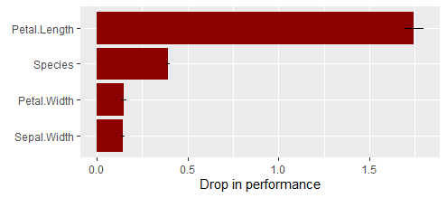
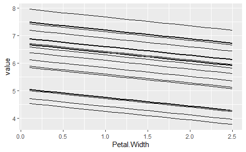
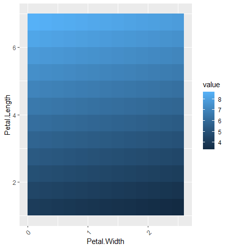
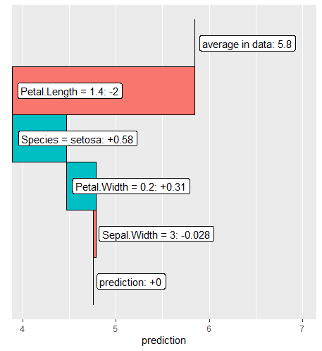

# {flashlight} <a href='https://github.com/mayer79/flashlight'></a>

<!-- badges: start -->

[](https://cran.r-project.org/package=flashlight)
[](https://github.com/mayer79/flashlight/actions)
[](https://app.codecov.io/gh/mayer79/flashlight?branch=main)

[](https://cran.r-project.org/package=flashlight) 
[](https://cran.r-project.org/package=flashlight)

<!-- badges: end -->

## Overview

The goal of this package is shed light on black box machine learning models.

The main props of {flashlight}:

1. It is simple, yet flexible.
2. It offers model agnostic tools like model performance, variable importance, global surrogate models, ICE profiles, partial dependence, ALE, and further effects plots, scatter plots, interaction strength, and variable contribution breakdown/SHAP for single observations.
3. It allows to assess multiple models in parallel.
4. It supports "group by" operations.
5. It works with case weights.

Currently, models with numeric or binary response are supported.

## Installation

```r
# From CRAN
install.packages("flashlight")

# Development version
devtools::install_github("mayer79/flashlight")
```

## Usage

``` r
library(ggplot2)
library(MetricsWeighted)
library(flashlight)

# Fit model
fit <- lm(Sepal.Length ~ ., data = iris)

# Make flashlight
fl <- flashlight(
  model = fit, 
  data = iris, 
  y = "Sepal.Length", 
  label = "ols",               
  metrics = list(rmse = rmse, `R-squared` = r_squared)
)
```

### Performance (overall and grouped by `Species`)

``` r
plot(light_performance(fl), fill = "darkred") +
  ggtitle("Overall")
plot(light_performance(fl, by = "Species"), fill = "darkred") +
  ggtitle("Grouped by Species")
```
<p>
  
  
</p>

### Permutation importance

``` r
imp <- light_importance(fl, m_repetitions = 4)
plot(imp, fill = "darkred")
```


### ICE curves for `Petal.Width`

``` r
plot(light_ice(fl, v = "Petal.Width"))
```


### Partial dependence plot for Petal.Width

```r
plot(light_profile(fl, v = "Petal.Width")) +
  ggtitle("Overall")
plot(light_profile(fl, v = "Petal.Width", by = "Species")) +
  ggtitle("Grouped by Species")
```
<p>
  
  
</p>

### 2D partial dependence

```r
plot(light_profile2d(fl, v = c("Petal.Width", "Petal.Length")))
```


### Accumulated local effects (ALE) profiles for Petal.Width

``` r
plot(light_profile(fl, v = "Petal.Width", type = "ale"))
```


### Prediction, response and residual profiles, e.g.

``` r
plot(light_profile(fl, v = "Petal.Width", type = "residual", 
                   stats = "quartile"))
```


### Different profile plots in one...

``` r
plot(light_effects(fl, v = "Petal.Width"), use = "all")
```


### Variable contribution breakdown for single observation

``` r
plot(light_breakdown(fl, new_obs = iris[2, ]))
```


### Global surrogate

``` r
plot(light_global_surrogate(fl))
```


Check out the vignette to see the full capabilities of the package.
