# {flashlight} <a href='https://github.com/mayer79/flashlight'></a>

<!-- badges: start -->

[](https://cran.r-project.org/package=flashlight)
[](https://github.com/mayer79/flashlight/actions)
[](https://app.codecov.io/gh/mayer79/flashlight?branch=main)

[](https://cran.r-project.org/package=flashlight) 
[](https://cran.r-project.org/package=flashlight)

<!-- badges: end -->

## Overview

The goal of this package is shed light on black box machine learning models.

The main props of {flashlight}:

1. It is simple, yet flexible.
2. It offers model agnostic tools like model performance, variable importance, global surrogate models, ICE profiles, partial dependence, ALE, and further effects plots, scatter plots, interaction strength, and variable contribution breakdown/SHAP for single observations.
3. It allows to assess multiple models side-by-side.
4. It supports "group by" operations.
5. It works with case weights.

Currently, models with numeric or binary response are supported.

## Installation

```r
# From CRAN
install.packages("flashlight")

# Development version
devtools::install_github("mayer79/flashlight")
```

## Usage

Let's start with an iris example. For simplicity, we do not split the data into training and testing/validation sets.

```r
library(ggplot2)
library(MetricsWeighted)
library(flashlight)

fit_lm <- lm(Sepal.Length ~ ., data = iris)

# Make explainer object
fl_lm <- flashlight(
  model = fit_lm, 
  data = iris, 
  y = "Sepal.Length", 
  label = "lm",               
  metrics = list(RMSE = rmse, `R-squared` = r_squared)
)
```

### Performance

```r
fl_lm |> 
  light_performance() |> 
  plot(fill = "darkred") +
  labs(x = element_blank(), title = "Performance on training data")

fl_lm |> 
  light_performance(by = "Species") |> 
  plot(fill = "darkred") +
  ggtitle("Performance split by Species")
```

<p>
  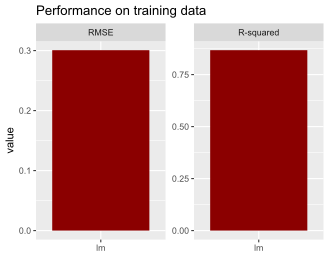
  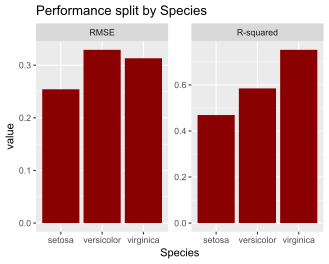
</p>


### Permutation importance regarding first metric

Error bars represent standard errors, i.e., the uncertainty of the estimated importance.

```r
fl_lm |>
  light_importance(m_repetitions = 4) |> 
  plot(fill = "darkred") +
  labs(title = "Permutation importance", y = "Increase in RMSE")
```

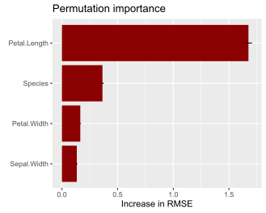

### ICE curves for `Petal.Width`

```r
fl_lm |> 
  light_ice("Sepal.Width", n_max = 200) |> 
  plot(alpha = 0.3, color = "chartreuse4") +
  labs(title = "ICE curves for 'Sepal.Width'", y = "Prediction")

fl_lm |> 
  light_ice("Sepal.Width", n_max = 200, center = "middle") |> 
  plot(alpha = 0.3, color = "chartreuse4") +
  labs(title = "c-ICE curves for 'Sepal.Width'", y = "Prediction (centered)")
```

<p>
  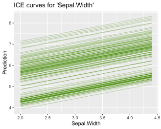
  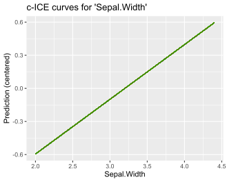
</p>

### PDPs

```r
fl_lm |> 
  light_profile("Sepal.Width", n_bins = 40) |> 
  plot() +
  ggtitle("PDP for 'Sepal.Width'")

fl_lm |> 
  light_profile("Sepal.Width", n_bins = 40, by = "Species") |> 
  plot() +
  ggtitle("Same grouped by 'Species'")
```

<p>
  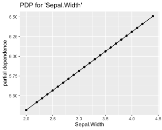
  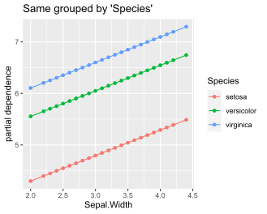
</p>

### 2D PDP

```r
fl_lm |> 
  light_profile2d(c("Petal.Width", "Petal.Length")) |> 
  plot()
```


### ALE

```r
fl_lm |> 
  light_profile("Sepal.Width", type = "ale") |> 
  plot() +
  ggtitle("ALE plot for 'Sepal.Width'")
```

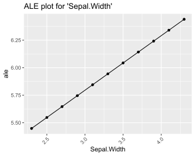

### Different profile plots in one

```r
fl_lm |> 
  light_effects("Sepal.Width") |> 
  plot(use = "all") +
  ggtitle("Different types of profiles for 'Sepal.Width'")
```


### Variable contribution breakdown for single observation

```r
fl_lm |> 
  light_breakdown(new_obs = iris[1, ]) |> 
  plot()
```


### Global surrogate tree

```r
fl_lm |> 
  light_global_surrogate() |> 
  plot()
```

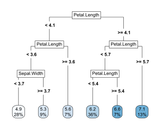

### Multiple models

Multiple flashlights can be combined to a multiflashlight.

```r
library(rpart)

fit_tree <- rpart(
  Sepal.Length ~ ., 
  data = iris, 
  control = list(cp = 0, xval = 0, maxdepth = 5)
)

# Make explainer object
fl_tree <- flashlight(
  model = fit_tree, 
  data = iris, 
  y = "Sepal.Length", 
  label = "tree",               
  metrics = list(RMSE = rmse, `R-squared` = r_squared)
)

# Combine with other explainer
fls <- multiflashlight(list(fl_tree, fl_lm))

fls |> 
  light_performance() |> 
  plot(fill = "chartreuse4") +
  labs(x = "Model", title = "Performance")

fls |> 
  light_profile("Petal.Length", n_bins = 40, by = "Species") |> 
  plot() +
  ggtitle("PDP by Species")
```

<p>
  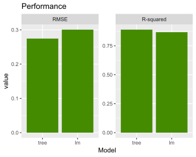
  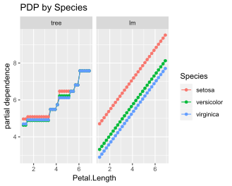
</p>

Check out the vignette for more...
